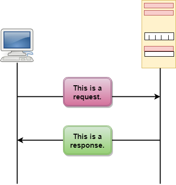
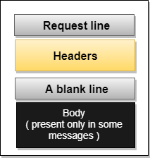
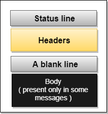
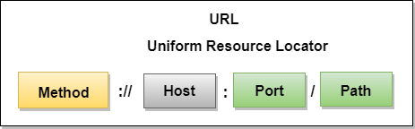

# NET ESSENTIALS

Savez-vous en réalité ce qui se passe lorsque vous tapez sur la barre de recherche de votre navigateur l'URL du site du Club des Jeunes Programmeurs https://club-jp.com ?

Votre appareil est en train en coulisse de demander d'afficher le contenu d'une page web qui se trouve sur une machine distante.

Tout d'abord, cette phrase soulève des questionnements:

* Mon appareil demande d'afficher ?
* Une page web ? Mais une page web c'est quoi ?
* Une machine ? Elle est à qui cette machine ?

Nous allons à travers les lignes qui suivent, expliquer dans les grandes lignes les principes de cette communication qui est au coeur même du web, et en général d'Internet.

## Quoi, Web et Internet c'est différent ?

Oui !

Le Web est un des nombreux services offerts par Internet. les autres services sont par exemple la messagerie email, le transfert de fichiers, etc.

Internet par contre c'est le réseau des réseaux. Littéralement cela signifie **Interconnected Networks**, sachant qu'un **réseau** est une communication entretenue entre deux et plusieurs machines.

Au coeur du Web, nous avons le *protocole* HTTP.

Un **protocole** c'est un ensemble de normes et de procédés qui permettent de réguler une communication.

## Que dit ce protocole ?

Le protocole HTTP est celui qui régit les communication sur le Web, à savoir, il s'agit de l'architecture Client / Serveur.

Le **client** est le demandeur tandis que le **serveur** est la machine qui est interrogée.

Les machines qui communiquent sur le web échangent des messages, qui peuvent être de deux nature: **request** ou bien **response**.

Le client envoie une demande (request)

Tandis que le serveur réponds (response)

## L'URL

Ce qui a rendu le Web intéressant et de facto l'Internet n'est rien d'autre que les hyperliens que l'on construit avec les URL.

Les **liens** permettent de relier une page Web à une autre.

Une **URL** (Uniform Resource Locator) par contre permet de localiser une resource ou bien du contenu (fichier) sur Internet.

Voici quelques exemples:

* https://club-jp.com/
* https://univ-labe.edu.gn/
* https://univ-labe.edu.gn/wp-content/uploads/2024/03/125A4402-2048x1365.jpg

## Client / Serveur

Maintenant que nous savons cela, reprenons cette image au début:

Vous devez retenir ceci:

Lorsque vous décidez de lancer le site du Club des Jeunes Programmeurs, indirectement, votre appareil demande à une certaine machine sur laquelle le site est stoqué de charger cette page.

La machine va donc répondre en envoyant le contenu de la page et puis votre appareil (ou particulièrement votre navigateur) va se charger de l'interpréter et afficher le résultat.

Voici donc décrit comment fonctionne le Web.

Mais cependant une question réside, comment on met cela en place ?

Eh bien, à travers cette série de formation, nous allons apprendre les technologies qui vont vous permettre d'arriver à cet objectif.

Plus spécifiquement, nous allons partager ensemble des techniques et technologies utilisées pour faire du développement web.

Alors vous êtes chaud ?

Rendez-vous dans le chapitre suivant où nous allons parler de la programmation web, et particulièrement du HTML et du CSS.